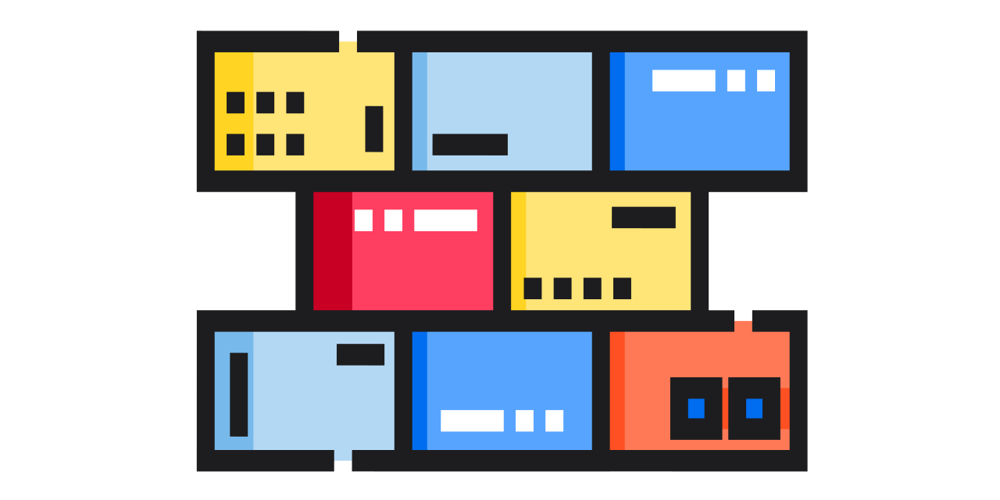
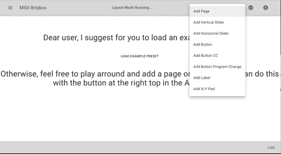

<p align="center">
  
</p>


# Midi-Bricks 

MIDI Bricks was invented for usage as interactive MIDI-Controller-Interface or even for Touch-Device purposes. We use the native MIDI API, which is exposed from chrome browser. Please note, that because of a sad story MIDI functionality is not provided on mobile devices. Therefore, in most cases our users provide them selves with some kind of extra physical Touch Device, which can be wired via USB to your Desktop / Laptop.

## Hardware Suggestions (tested successfully)
### Working Device
- https://www.raspberrypi.org/products/raspberry-pi-400/ or win or macosx device

### Touch Device
https://www.waveshare.com/wiki/7inch_HDMI_LCD_(H)_(with_case)

## Download and Install

Go To https://github.com/TimSusa/midi-bricks/releases and find the latest or beta release. There is a caret with "assets". Please click the caret to have the download links available.

- Mac OSX: Please, download the *.dmg File (can be seen on "assets" at the bottom here) and double click
- Windows 7 and above: Please, download the *.exe File (can be seen on "assets" at the bottom here) and double click
- raspberry-pi 4 and above: Please, download the AppImage File, chmod +x the file to make it executable and then start it

## Live-Web-Demo
https://midi-bricks.timsusa.now.sh

<p align="center">
  
</p>


## Official Webpage and Documentation
https://timsusa.github.io/midi-bricks-mono/


## Installation
```
yarn 
```


# Webapp
## Start Development
```
yarn start
```

## Build for Production
```
yarn build
```


# Electron App
## Start Development
```
yarn dev
```

## Build for MacOSX, Rasperry Pi and Win
```
yarn build-ci
```


# Contributing
Please consider to create a PR with or without any issue. 
I will get back to you, asap.

# Versioning
https://github.com/conventional-changelog/standard-version

