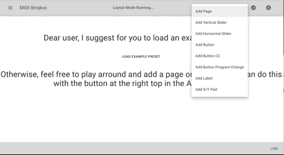

<p align="center">
  
</p>


# Midi-Bricks 

MIDI Bricks was invented for usage as interactive MIDI-Controller-Interface or even for Touch-Device purposes. We use the native MIDI API, which is exposed from chrome browser. Please note, that because of a sad story MIDI functionality is not provided on mobile devices. Therefore, in most cases our users provide them selves with some kind of extra physical Touch Device, which can be wired via USB to your Desktop / Laptop.

## Mono Repository
This is a mono-repository for midi-bricks and its documentation. 

## Live-Web-Demo
https://midi-bricks.timsusa.now.sh

<p align="center">
  
</p>

## Official Webpage and Documentation
https://timsusa.github.io/midi-bricks-mono/


## Bootstrapping the Monorepo:
```
yarn && yarn bootstrap
```


# Webapp
The midi-bricks folder poses the core source, which is a standalone webapp.
Furthermore, it is deployed to the great guys from https://zeit.co/now. 

## Start Development
```
yarn dev:midi-bricks
```

## Build for Production
```
yarn build:midi-bricks
```


# Electron App
The core web app will be copied into the electron ecosystem. 
Further code for configuration, especially ```electron.js```,
can be found in its public folder. 


## Start Development
```
yarn dev:midi-bricks-electron
```

## Build for MacOSX, Rasperry Pi and Win
```
yarn build:midi-bricks-electron-ci
```


# Contributing
Please consider to create a PR with or without any issue. 
I will get back to you, asap.

# Versioning
https://github.com/conventional-changelog/standard-version

